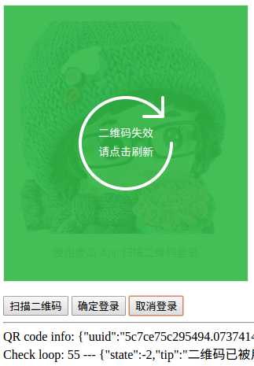

# QR Code Demo

该项目的主要目是为了学习扫码登录的主要流程。

提示：该项目没有客户端，应此需要通过调用接口模拟客户端的操作。

## 前提条件

用户在网页端未登录、用户在客户端已经登录（这里用接口来代表客户端）。

## 扫码登录步骤

1. 用户打开网页；
2. 网页端请求接口获取一个 uuid 并将它渲染成一张二维码图片；
3. 网页端开始轮询检测该 uuid 的状态（即二维码的状态）；
3. 用户拿起手机并打开对应的 APP 扫描网页上的二维码；
4. 扫描后，手机 APP 询问用户是否确认登录或者取消本次操作；
5. 用户在手机 APP 点击确认登录按钮；
6. 网页端检测到 uuid 变成已确认状态后，会调用 uuid 登录接口（该接口会生成保持用户状态的 Cookie）；
7. 网页端跳转到网站首页，完毕。

## 主要接口

### 获取 uuid

只用于 Web 端，初始打开登录页面或刷新登录页面都会调用。

```
/qrcode/get
```

该接口返回以下信息：

```json
{
    "uuid":"5c7ce144dbc4a0.53849626",
    "qrcode":"http://qrcode.example.com/qrcode/scan?uuid=5c7ce144dbc4a0.53849626"
}
```

`qrcode` 就是二维码的内容，APP 扫描以后直接请求该地址即可，这有利于发版后接口的迭代。

### 检测 uuid 状态

只用于 Web 端，该接口会不停轮询调用。

```
/qrcode/check?uuid={:uuid}
```

uuid 有以下状态：

1. 初始化
2. 已扫描
3. 已登录（即已被使用）
4. 已过期
5. 已取消

有两个特别的地方需要指出：

1. 用户使用 APP 扫描二维码后，该接口会返回用户的头像，更利于用户辨认；
2. 用户确认登录后，该接口会返回一个 ticket，用于完成 uuid 进行的登录，防止有人恶意刷登录接口；
 
对于以上的说明，建议直接看接口返回的内容和源代码。

### 扫描二维码

用户在 APP 端扫描二维码后，APP 会调用该接口。该接口地址实际上也是二维码的内容。

```
/qrcode/scan?uuid={:uuid}
```

该接口返回以下信息：

```json
{
    "confirm_url":"http://qrcode.example.com/qrcode/confirm?uuid=5c7ce20ae619a1.18514665",
    "cancel_url":"http://qrcode.example.com/qrcode/cancel?uuid=5c7ce20ae619a1.18514665"
}
```

`confirm_url` 是确认登录时所调用的接口，而 `cancel_url` 是取消登录所调用的接口。

### 确认登录

用户在 APP 端确认登录后，APP 会调用该接口。

```
/qrcode/confirm?uuid={:uuid}
```

### 取消登录

当用户取消本次操作时会调用该接口。

```
/qrcode/cancel?uuid={:uuid}
```

### uuid 登录

网页端获知 uuid 状态已经变成已确认后，则会调用该接口，完成登录操作。

```
/login/qrcode=?ticket={:ticket}&uuid={:uuid}&time={:timestamp}
```

上面已经提到过，ticket 是为了安全起见而添加。

## 部署方法

### 项目依赖：

- PHP 7
- [Phalcon 3.4](https://phalconphp.com)

能让项目跑起来就好，可不必太过受制于 Phalcon 框架本身，它只是个普通的 PHP extension.

克隆本项目

```sh
cd /path/to
git clone git@github.com:aisuhua/qrcode-demo.git
```

### Nginx 配置

```nginx
server {
    listen        80;
    server_name   qrcode.example.com;

    root /path/to/qrcode-demo/public;
    index index.php index.html index.htm;

    charset utf-8;
    client_max_body_size 100M;
    fastcgi_read_timeout 1800;

    location / {
        try_files $uri $uri/ /index.php?_url=$uri&$args;
    }

    location ~ [^/]\.php(/|$) {
        fastcgi_pass  127.0.0.1:9000;
        fastcgi_index /index.php;

        include fastcgi_params;
        fastcgi_split_path_info ^(.+?\.php)(/.*)$;
        if (!-f $document_root$fastcgi_script_name) {
            return 404;
        }
        
        fastcgi_param PATH_INFO       $fastcgi_path_info;
        fastcgi_param SCRIPT_FILENAME $document_root$fastcgi_script_name;
    }

    location ~ /\.ht {
        deny all;
    }

    location ~* \.(js|css|png|jpg|jpeg|gif|ico)$ {
        expires       max;
        log_not_found off;
        access_log    off;
    }
}
```

也可以参考 Phalcon 官方给出的示例 [Web Server Setup](https://docs.phalconphp.com/3.4/en/webserver-setup)

## 截图演示

初始状态


扫描二维码


二维码已过期



## TODO

- 轮询的调用方式不止有延迟，也会增加了大量的无效请求，有待改进。


